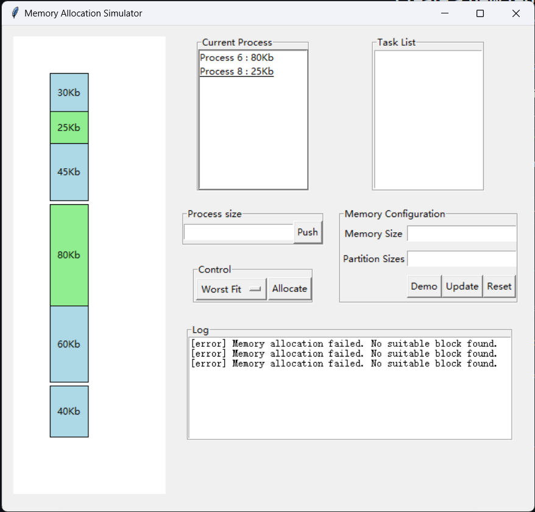
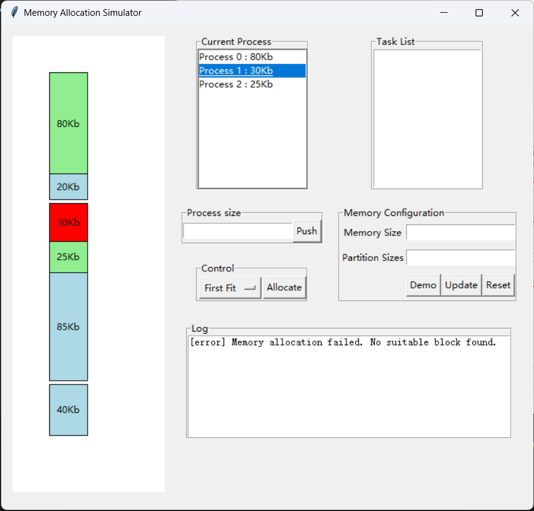
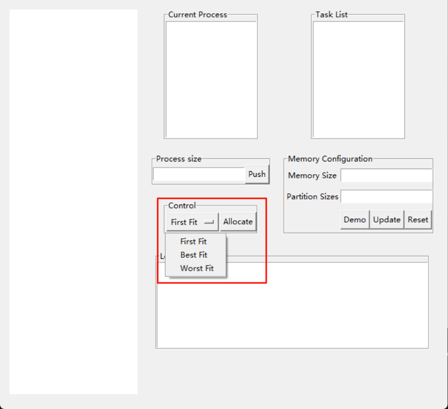

# Memory Allocation Algorithm

This repository contains a Python program for visualizing various memory allocation algorithms, including First Fit, Best Fit, Worst Fit, and Next Fit.

Project inspired by [this](https://github.com/Pruthvirajsinh7/Memory-Allocation-Algorithm) repo.

## Preview


## Running the Program

1. Clone the repository to your local machine:

    ```bash
    git clone https://github.com/zenor0/memory-allocation-algorithm.git
    ```

2. Navigate to the repository directory:

    ```bash
    cd memory-allocation-algorithm
    ```

3. Run the main.py script:

    ```bash
    python main.py
    ```

4. Enter `partition size` in `Memory config` frame (split multi partition by space ` ` ).
   
5. Allocate `process size` (split multi process by space ` ` ).

6. Click `Allocate` button to run algorithm.

6. The GUI will display the total memory with partitions. You can enter process sizes and choose the allocation algorithm from the menu.


## Hints

1. You can select the memory allocation algorithm from the drop-down menu.


2. You can enter multiple process sizes by separating them with spaces.


3. You can visualize see what process you've selected by hovering over the process in the GUI.


4. You can de-allocate a process by double-clicking on it.


5. You can delete task by double-clicking on it.


6. Click `Demo` button to run demo.

## Examples

### Screenshots

1. Highlighting the process that is currently being allocated.



2. algorithm selection.
   


Feel free to explore and experiment with different scenarios to understand how each memory allocation algorithm behaves.
